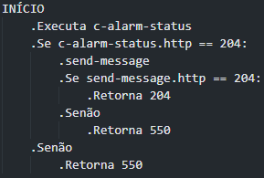
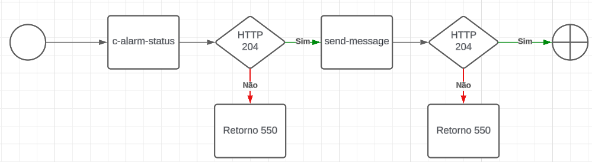

# orch-fire-alarm-activated - 1.0.0

#### Orquestra: send-message
#### Orquestra: c-alarm-status

Acessado por: POST /access/v1/orch-fire-alarm-activated

Ambiente: Middleware

Adaptador: HTTP Adapter

### Descrição

```bash
    Este orquestrador é responsável por receber o alarme de detecção de incêndio
```

### Consumidores
| Consumidor | Client-id  |
|------------|------------|
| Raspberry  | Raspyan-fd |

### Histórico de alterações
| Versão |    Data    |     Autor    |     Demanda     |    Descrição   | Revisor | Entrega em UAT |
|--------|------------|--------------|-----------------|----------------|---------|----------------|
| 1.0    | 18/09/2024 | Rafael Prado | Demanda inicial | Versão inicial | -       | -              |

### Mensagem MW

Mensagem (JSON) de requisição
```bash
    POST - http://{server}:{port}/access/v1/orch-fire-alarm-activated
    messageId: {messageId}
    clientId: {clientId}

    body: {
        "responsible_for_activating":"{
            {
                "full_name": "?",
                "phone": "?"
            }
        }"
        "camId": "?",
        "camDescription": "?"
    }
```

Mensagem (JSON) de resposta
```bash
    HTTP/1.1 204

    body: {}
```

### Mapeamento de entrada

|        Tag SPPIDIMW         |                     Desctição                   |     Obrigatório    |     Tipo de dado     | Regra |
|-----------------------------|-------------------------------------------------|--------------------|----------------------|-------|
| responsible_for_activating  | Telefone e nome do responsável para acionamento | Sim                |  string              | -     |
| camId                       | ID do equipamento cadastrado                    | Sim                |  string              | -     |
| camDescription              | Descrição do equipamento acionado               | Sim                |  string              | -     |

### Mapeamento de saída

|        Tag SPPIDIMW         |                  Desctição                 |     Obrigatório    |     Tipo de dado     | Regra |
|-----------------------------|--------------------------------------------|--------------------|----------------------|-------|


### Fluxograma

### Diagrama



### Serviços executados
| Ordem execução |      Serviço executado      | Adaptador |                      Regra                      | Paradigma | Tipo da mensagem |
|----------------|-----------------------------|-----------|-------------------------------------------------|-----------|------------------|
| 1              | c-alarm-status              | HTTP      | Executar sempre                                 | SYNC      | request          |
| 2              | send-message                | HTTP      | Executar se sucesso no step c-alarm-status      | SYNC      | request          |

### Regras

|   Condição  |         Regra        |
|-------------|----------------------|
| Timeout     | 5s                   |
| Retentativa | 5x a cada 5 segundos |
| Repetição   | -                    |
| Intervalo   | -                    |

### Mapeamentos

### Request

send-message
|          Mappeia de:        |   Mapeia para:             | Obrigatório |    Obervação    |
|-----------------------------|----------------------------|-------------|-----------------|
| responsible_for_activating  | responsible_person         | Sim         | Enviado no body |

c-alarm-status
|   Mappeia de:  |   Mapeia para:   | Obrigatório |    Obervação    |
|----------------|------------------|-------------|-----------------|
| client_id      | client_id        | Sim         | Enviado no body |
| cam_id         | client_id        | Sim         | Enviado no body |


#### Response

send-message
|          Mappeia de:        |   Mapeia para:             | Obrigatório |    Obervação    |
|-----------------------------|----------------------------|-------------|-----------------|

c-alarm-status
|   Mappeia de:  |   Mapeia para:   | Obrigatório |    Obervação    |
|----------------|------------------|-------------|-----------------|

### Erros funcionais

Condições de sucesso

| Código MW | Descrição | Código retornado do provedor  |
|-----------|-----------|-------------------------------|
| 204       | Sucesso   | Todos os serviços com sucesso |

Condições de erro

| Código MW |                  Descrição                 |  Código retornado do provedor  |
|-----------|--------------------------------------------|--------------------------------|
| 550       | 550 + erro retornado do serviço com falha  | Qual quer erro não mapeado     |

